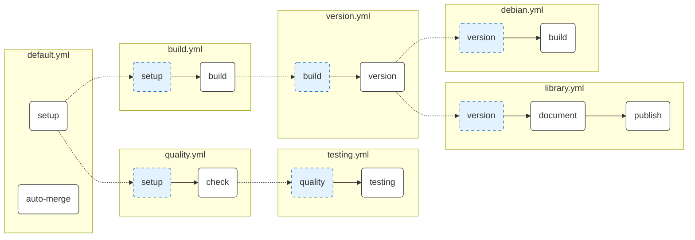

# NodeJS Actions Workflows

## Description

This directory contains a collection of reusable GitHub Actions workflows designed for NodeJS projects. These workflows provide a modular, standardised approach to CI/CD pipelines covering common tasks such as quality checks, testing, building, versioning, documentation, publishing, and Debian package creation.

## Setup Guide

To integrate these workflows into your project, reference them using the `uses` keyword in your GitHub Actions workflow files.

### Required Permissions

When calling these workflows, ensure your caller workflow has the necessary permissions. The `version` and `library` workflows in particular require write access to create releases and push packages.

```yaml
permissions:
  contents: write # Required for semantic-release (tagging, changelog)
  packages: write # Required for publishing to GitHub Packages
  id-token: write # Required for provenance generation
  security-events: write # Required for uploading Sarif reports (Trivy/Gitleaks)
```

### Common Inputs

- **`working_directory`** (string, default: `'.'`): Path to the directory containing `package.json`.
- **`node_version`** (string, default: `'22'`): The version of Node.js to use.
- **`artifact_name`** (string, default: `'dist'`): The name of the artifact to upload/download between build and publish/package steps. _(Available in `build`, `library`, and `debian` workflows)_
- **`enable_secrets`** (boolean, default: `true`): Controls whether secrets scanning (Gitleaks) is enabled in workflows that include it.

### Common Secrets

- **`NPM_TOKEN`**: Required for publishing to private npm registries via `library.yml`.
- **`GITHUB_TOKEN`**: Automatically provided. For security scanning workflows (Gitleaks, Trivy) to upload results to GitHub Code Scanning, the `GITHUB_TOKEN` requires `security-events: write` and `actions: read` permissions. It is also used for `semantic-release`, GitHub Packages, and Dependabot automation.

## Usage Examples

**Basic Testing Pipeline:**

```yaml
jobs:
  testing:
    uses: apollogeddon/forgejs/.github/workflows/testing.yml@main
```

**Full Versioned CI/CD:**

```yaml
jobs:
  version:
    uses: apollogeddon/forgejs/.github/workflows/version.yml@main
    secrets:
      GITHUB_TOKEN: ${{ secrets.GITHUB_TOKEN }}
```

**Library Publishing:**

```yaml
jobs:
  publish:
    uses: apollogeddon/forgejs/.github/workflows/library.yml@main
    with:
      artifact_name: 'my-lib-dist'
    secrets:
      NPM_TOKEN: ${{ secrets.NPM_TOKEN }}
```

## Architecture

The following diagram illustrates the flow of jobs within the primary orchestration workflows.



## Dependencies & Job Reference

The table below details every job defined in this collection, categorised by the file where it is implemented.

| File | Job ID | Internal Dependencies | Description |
| :--- | :--- | :--- | :--- |
| **`default.yml`** | `setup` | _None_ | **Environment Setup**: Prepares Node.js, caches dependencies, installs them via `npm ci`, and runs `npm audit --audit-level=high` for security. |
| | `auto-merge` | _None_ | **Automation**: Automatically merges Dependabot PRs for minor and patch updates (triggered on `pull_request_target`). |
| **`quality.yml`** | `setup` | _None_ | **Initialisation**: Calls `default.yml` to prepare the environment. |
| | `check` | `setup` | **Static Analysis**: Runs Biome linting (`npx @biomejs/biome check .`) and TypeScript type checking (`npx tsc --noEmit`) in a single pass. |
| **`testing.yml`** | `quality` | _None_ | **Quality Gate**: Calls `quality.yml` to enforce code standards before testing. |
| | `test` | `quality` | **Unit Tests**: Executes the testing suite (`npm test`) and uploads the `coverage` directory as an artifact. |
| **`build.yml`** | `setup` | _None_ | **Initialisation**: Calls `default.yml` to prepare the environment. |
| | `build` | `setup` | **Compilation**: Builds the project (`npm run build`) and uploads the artifact specified by `artifact_name` (default: `dist`). |
| **`version.yml`** | `build` | _None_ | **Build Gate**: Calls `build.yml` to ensure artifacts are built successfully. |
| | `version` | `build` | **Release Management**: Automates versioning, tagging, and release notes via `semantic-release` (on `main` branch). |
| **`library.yml`** | `version` | _None_ | **Core Pipeline**: Calls `version.yml` to handle building and release. |
| | `document` | `version` | **Documentation**: Generates API docs (`npm run doc`) and deploys to GitHub Pages (triggered on `release` branch). |
| | `publish` | `document` | **Registry Publish**: Publishes the package to the configured npm registry with **provenance** (triggered on `release` branch). |
| **`debian.yml`** | `version` | _None_ | **Core Pipeline**: Calls `version.yml` to handle building and release. |
| | `build` | `version` | **Debian Packaging**: Downloads the build artifact, packages it as a `.deb` installer using `npx snodeb`, and uploads it. |

## Troubleshooting

- **`npm error Missing script: "test"`**: Ensure your `package.json` contains a `test` script. If you have no tests, use `"test": "echo 'No tests' && exit 0"`.
- **Authentication Errors**: Verify that `GITHUB_TOKEN` is passed to `version.yml` and `NPM_TOKEN` (if needed) is passed to `library.yml`.
- **Artifact Errors**: If `debian` or `library` fails to find artifacts, ensure the upstream `build` job is producing an artifact matching the `artifact_name` input (default: `dist`).
